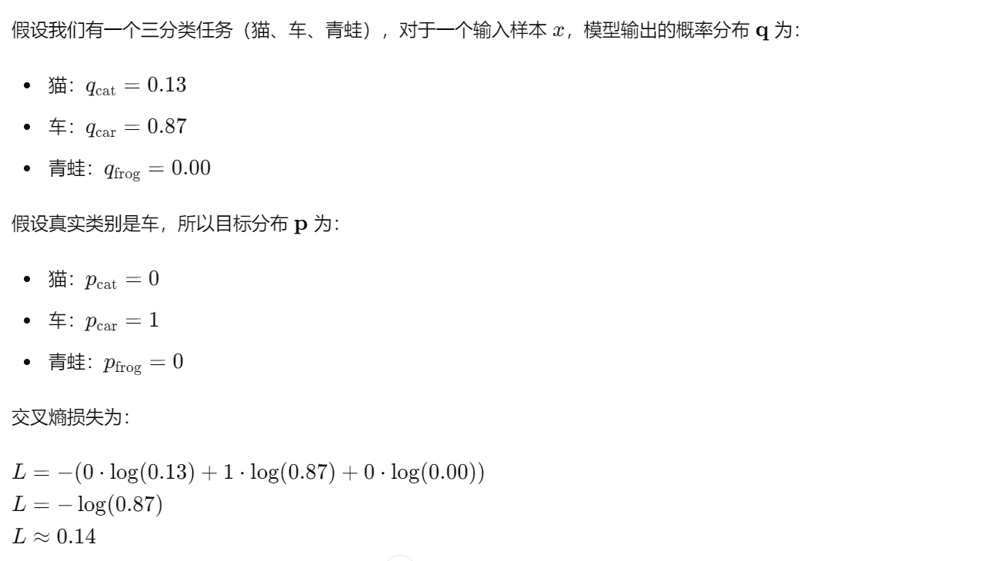

<center>lesson2</center>

我们的算法需要去识别一直猫，但这个算法最好有一定的泛化性，比如在不同的光照条件下，比如猫的不同姿势，猫只露出了一部分，小猫发生了变异，这个算法最好都可以识别出猫。

做了一些常识，比如先找出猫的轮廓，然后对线进行一些编码，来识别。这个效果并不好。


另一种方法是基于数据驱动的方法：

1. 收集图像和标签的数据
2. 使用机器学习去训练分类器
3. 评估新的图像的类型

```python
def train (image, labels):
    # Machine Learning!
    return model

def predict (model, test_images):
    #use model to predict labels
    return test_tabels
```

**问题**：如何去比较两个图像是否一致？

第一想法：L1距离，又叫Manhattan距离，直接较对应像素的值


## 最近邻方法

测试的图与每个图进行比较，算出L1距离，然后找到最小的距离的索引，即为这个点的值

**反思：**

这个方法不够快，记忆数据是O(1)但是在预测时候是O(n)，因为要和n个案例做比较。

**我们能够接受，在训练的时候花费更多的时间，但是在部署预测时最好速度要足够快**，K近邻刚好相反

我们可以思考在一个区域内散落不同颜色点，对于没有散落点的区域我们需要进行最近邻来确定其颜色。这样的方法，对于一些凸点或者围绕点效果会很差（图1最左）。


**改进方法**

一种解决方法是采用了所谓的K-近邻方法，周围最近的k个点进行投票。这样会使得边界更加光滑


另一种思考是，我们如何去对比不同的点之间的值，**K近邻使用的是L1，像素之间的绝对值之和**

 另一种常见的选择是**L2或者欧几里得距离**


L1距离又叫Manhattan距离，方方正正的，走的是横平竖直的。

A(1, 6)

B(6, 10)

那么其L1距离是
$$
d_1 = |(6-1) + (10 - 6)|
$$
通过指定不同的距离度量，我们可以将K近邻应用于基本上任何类型的数据

> 我觉得最关键的其实是边界值的问题，当改变K的数量以及不同的距离度量，主要影响也是在**边界上的问题**

所以确定K的数量和不同的距离的度量很重要，这两个是所谓的超参数

**超参数是我们设定的，而不是通过算法学习的**。

提前作出算法的选择 ：这些参数比较依赖于问题，最常用的方法是穷举法

### 设定超参数

1. 选择那些在数据上工作的很好的超参数，但这种不好，因为当K=1总是能够工作的很完美在数据集上，实际上，我们并不关系在训练集上的拟合效果
2. 划分训练和测试，也是不OK的 不知道算法如何在新数据上的表现
3. 划分为三类，训练、 验证，测试
4. 交叉验证，通常用在小数据集
   在前四折设置一组超参数，然后评估第五折
   在设置一组超参数，评估第四折
   进而确定最好的超参数

> 测试集实际上应该是代表独立同分布的数据，但实际上测试集可能无法完全代表，这是数据集创建者和数据集管理者需要考虑的问题
>
> 当创建数据集时，最好使用完全相同的方法来一次性收集一大堆数据，然后再对其进行分区，分区最好要具有随机性


采用相同的5折交叉验证，训练不同的k超参数，在验证集上得到误差，然后我们可以看到其超参数变化的一个分部，能够推断出该问题超参数的最优解。


K-近邻方法在图像上**几乎没有使用过**，主要是有两个方面：

1. 与我们所期望的算法速度不一样，我们期望的是训练时间可以长，但是测试要短点，实际K近邻相反
2. 像素的距离度量实际上不能提供信息，这些矢量距离函数与图像之间的感知相似性并不能很好的对应。
   实际上，某些图像经过一些变换，其L2 距离还是相等的，所以我们可以认为**L2距离并不能够很好的捕捉图像之间的这些距离变化**
3. 纬度问题 curse of dimensionality
   因为K近邻很依赖于周围点，所以我们需要在周围覆盖一定的数量的点。这意味着我们需要大量的训练数据，数据是指数级增长

   


## 线性分类

> 因为上一章提到的最近邻方法不好，所以我们需要新的方法来代替，这就是深度学习，神经网络，他是一个多层的结构，我们从最基本的组件开始

我们可以使用许多组件，然后组合在一起来构建一个大的卷积网络。

不同的深度学习的最基本的组件就是线性分类器。

本节我们将要进行的例子就是：给定一个图像，然后输出一段描述性的语句


 判断一个图像的类别，首先将图片转换成X，然后通过W来进行筛选，得到不同类型的分数。

通过训练后，我们只需要参数W，在后续测试中，我们只需要这个参数w就好，不再需要训练数据，所以现在我们的模型更加高效。

> 深度学习所做的工作就是为这个函数$f$提出正确的结构
>
> 我们提出不同的不同的$W$和$x$组合来得到不同的结构

最简单的就是$f(x,W) = Wx$直接相乘----线性分类器

f得结果是分类的各种概率，总共10类，所以是每个类型的概率


有时候我们会有一个==偏差b==，这个偏差不是与训练数据有关，而是由我们提供，他表示数据的一种侧重和不平衡性

例如数据集中不平衡且猫比狗多，那么与猫对应的偏差元素就会高于其他元素，那么对应得到的分数就可能会更高一点


线性分类器的权重矩阵W每一行可以看成是对应某一类的分类模板，因为这一行与x相乘后得到的是该类的分数（**可以理解为模板匹配的方法**）

我们可以对不同的模板进行可视化，这有时候可视化出来的并不一定很像原本的类，这主要是因为线性分类器会平均这些不同的变化，这一步是将W矩阵重新再reshape成图像，例如上述的W矩阵本来是$10\times3072$，每一行其实都是某一个类的类别分类器，也就是$1×3072$，将其reshape成$32 \times 32\times 3$ ，这样就能得到所谓的模板。

线性分类器也有一定的缺点，比如异或问题， 环形数据多模态等问题


线性分类器比较好理解，实际上其实就是通过训练后，得到一个划分的直线


使用线性分类器的目标就是找到一个合适的权重$w$，关于如何找到这么一个权重，我们需要一个$loss\ function$来量化我们得分的不满意程度，这个损失函数会鼓励正确的分数，而惩罚错误的分数。

给定一个数据集${(x_i,y_i)}_{i=1}^{N}$，其中$x_i$是图像，$y_i$是标签，那么误差则是：
$$
L = \frac{1}{N}\Sigma L_i(f(x_i,w),y_i)
$$
这里在PDF中简单介绍了一下SVM的$loss function$，具体可以看一下letture -p68

我们现在想要将分数转换成概率，因此进一步引入了归一化：
$$
P(y=k|x=x_i)=\frac{e^sk}{\Sigma_j e^sj}
$$
这时候我们考虑损失函数分别是交叉熵损失和KL散度

**交叉熵损失**：
$$
L=-\Sigma_{i=1}^C p_i log(q_i)
$$
如果是$one\ hot$编码的话，那么只有目标类别的$p_j=1$，其余均为0



> **直观理解**：交叉熵损失衡量的是模型预测的概率分布与真实分布之间的不一致程度。损失越小，表示预测分布与真实分布越接近，模型性能越好。
>
> **优化目标**：训练过程中，模型通过梯度下降算法最小化交叉熵损失，使预测概率更接近于真实类别的one-hot分布，从而提高分类准确性

**KL散度**

另一种衡量两个概率分布之间差异的度量工具。

KL散度可以看作是交叉熵损失减去真实分布的熵
$$
D_{KL}(P||Q)=\Sigma_{i=1} p_i log(\frac{P_i}{Q_i})\\
=H(P,Q)-H(P)\\
=-\Sigma_{i=1} p_i log(Q_i) + \Sigma_{i=1} p_i log(P_i)
$$


在最后对比一下softmax和SVM。


